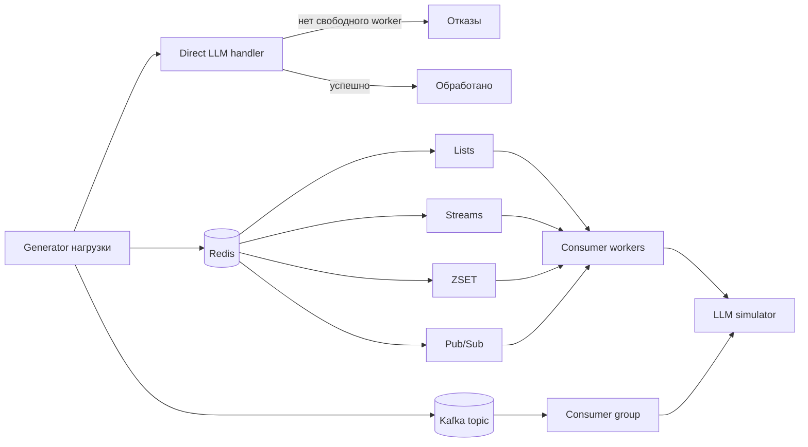
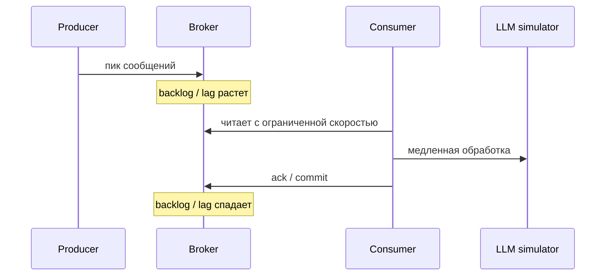

# Дополнительное задание: сглаживание пиков через Redis и Kafka

Проект демонстрирует, как брокер сообщений помогает выдерживать пики нагрузки. В роли медленного сервиса используется имитация LLM-обработчика: generator быстро создает задания, а consumer обрабатывает их с ограниченной скоростью.

Главная идея: без брокера часть запросов отклоняется, а с брокером сообщения накапливаются в очереди/topic и затем постепенно разбираются consumer-ами.

## Что реализовано

| Режим | Интерпретация | Что видно на демонстрации |
| --- | --- | --- |
| `direct` | Без очереди | При пике появляются отказы |
| `pubsub` | Redis Pub/Sub | Сообщения без подписчика теряются, накопления нет |
| `list` | Redis Lists | FIFO-очередь растет и затем уменьшается |
| `stream` | Redis Streams | Consumer group, `XPENDING`, `XACK`, спад backlog |
| `zset` | Redis Sorted Set | Отложенная очередь по score, постепенная обработка |
| `kafka` | Apache Kafka | Topic, consumer group, lag, спад накопления |

Дополнительно есть:

- запуск всех режимов одной кнопкой и одной CLI-командой;
- сценарий delayed consumer: сначала producer создает пик, затем consumer стартует позже и разгребает накопление;
- healthcheck-команда `doctor` для Redis и Kafka;
- web UI с карточками метрик, графиками Chart.js, отдельными диаграммами по режимам и таблицей интерпретации;
- интеграционные тесты для Redis и Kafka.

## Скриншоты

Положи скриншоты в каталог `assets` с такими именами:

```text
assets/ui-dashboard.png
assets/comparison-chart.png
assets/kafka-lag.png
```

После этого они будут отображаться в README:


## Архитектура





## Установка

```bash
cd Additional_task
python -m pip install -r requirements.txt
docker compose up -d
```

Сервисы:

- Redis: `127.0.0.1:6379`
- Kafka: `127.0.0.1:9092`

Проверить готовность:

```bash
python main.py doctor
```

## Web UI

```bash
python main.py web
```

Открыть:

```text
http://127.0.0.1:5000/
```

Если порт занят:

```bash
python main.py web --port 5001
```

В UI есть:

- запуск каждого режима отдельно;
- запуск общего сравнения всех режимов;
- delayed consumer сценарий;
- карточки метрик;
- общий сравнительный график с масштабированием и перемещением по истории;
- отдельные графики по режимам;
- отдельные графики по смыслу метрик: накопление, отказы/потери, обработка, задержка;
- расширенная история измерений, чтобы после тяжелого сравнения линии предыдущих режимов оставались на графиках;
- таблица последних измерений;
- проверка Redis/Kafka.

## CLI-сценарии

Сбросить метрики Redis:

```bash
python main.py reset
```

Проверить Redis и Kafka:

```bash
python main.py doctor
```

Запустить все режимы последовательно:

```bash
python main.py compare --jobs 60 --burst 30 --workers 2 --processing-ms 150
```

Для тяжелой демонстрации время ожидания полного разбора рассчитывается автоматически по числу заданий, workers и времени обработки. При необходимости его можно задать явно:

```bash
python main.py compare --jobs 500 --burst 200 --workers 2 --processing-ms 400 --max-wait-seconds 220
```

Показать delayed consumer:

```bash
python main.py delayed --mode stream --jobs 60 --burst 30 --consumer-delay-seconds 2
python main.py delayed --mode kafka --jobs 60 --burst 30 --consumer-delay-seconds 2
```

Запуск отдельных режимов:

```bash
python main.py scenario --mode direct --jobs 100 --burst 50
python main.py scenario --mode pubsub --jobs 100 --burst 50
python main.py scenario --mode list --jobs 100 --burst 50
python main.py scenario --mode stream --jobs 100 --burst 50
python main.py scenario --mode zset --jobs 100 --burst 50
python main.py scenario --mode kafka --jobs 100 --burst 50
```

Отдельный producer:

```bash
python main.py producer --mode list --jobs 100 --burst 50
python main.py producer --mode stream --jobs 100 --burst 50
python main.py producer --mode zset --jobs 100 --burst 50
python main.py producer --mode kafka --jobs 100 --burst 50
```

Отдельный consumer:

```bash
python main.py consumer --mode list
python main.py consumer --mode stream
python main.py consumer --mode zset
python main.py consumer --mode kafka
```

## Ручная проверка накопления

Redis:

```bash
docker compose exec -T redis redis-cli LLEN additional:list:jobs
docker compose exec -T redis redis-cli XLEN additional:stream:jobs
docker compose exec -T redis redis-cli XPENDING additional:stream:jobs llm-workers
docker compose exec -T redis redis-cli ZCARD additional:zset:jobs
docker compose exec -T redis redis-cli HGETALL additional:metrics:stream
```

Kafka:

```bash
docker compose exec -T kafka /opt/kafka/bin/kafka-topics.sh --bootstrap-server 127.0.0.1:9092 --describe --topic additional.kafka.jobs
docker compose exec -T kafka /opt/kafka/bin/kafka-consumer-groups.sh --bootstrap-server 127.0.0.1:9092 --describe --group additional-kafka-workers
```

## Ключи и сущности

| Назначение | Имя |
| --- | --- |
| Redis Pub/Sub канал | `additional:pubsub:jobs` |
| Redis List queue | `additional:list:jobs` |
| Redis Stream | `additional:stream:jobs` |
| Redis Stream group | `llm-workers` |
| Redis ZSET delayed queue | `additional:zset:jobs` |
| Kafka topic | `additional.kafka.jobs` |
| Kafka consumer group | `additional-kafka-workers` |
| Метрики | `additional:metrics:*` |
| История измерений | `additional:measurements` |

## Структура

```text
Additional_task/
  assets/
    .gitkeep
  docker-compose.yml
  main.py
  requirements.txt
  README.md
  src/redis_broker_demo/
    app.py
    broker.py
    direct.py
    health.py
    kafka_broker.py
    metrics.py
    models.py
    scenarios.py
  templates/
    index.html
  tests/
    test_broker_demo.py
```

## Тестирование

```bash
python -m unittest discover -s tests -v
```

Проверяется:

- сериализация задания;
- перегрузка direct-режима;
- накопление и спад Redis List;
- обработка Redis Stream через `XACK`;
- потеря Pub/Sub-сообщения без подписчика;
- накопление и спад ZSET-очереди;
- Kafka topic и consumer group;
- очистка ключей `additional:*`.

## Вывод

Проект показывает несколько способов интерпретировать задачу про брокер сообщений. Для сглаживания пиков подходят Redis Lists, Redis Streams, Redis ZSET и Kafka: они сохраняют накопление и дают consumer-ам обработать его в своем темпе. Pub/Sub специально оставлен как контрастный пример: это канал событий без надежной очереди, поэтому сообщения без подписчика теряются. Kafka добавлена как классический внешний брокер, а Redis Streams показывает похожую модель внутри Redis.
