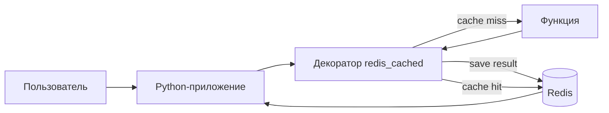
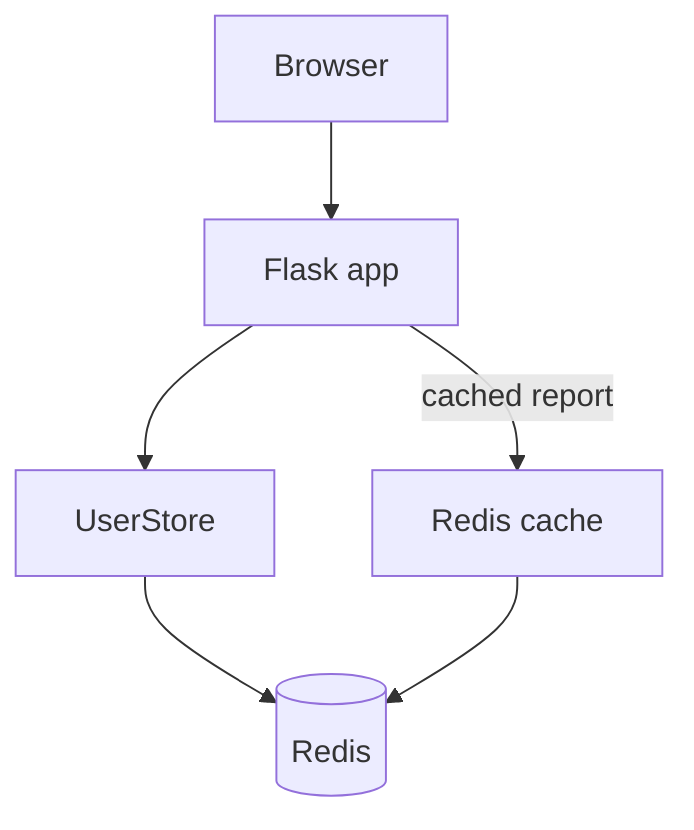
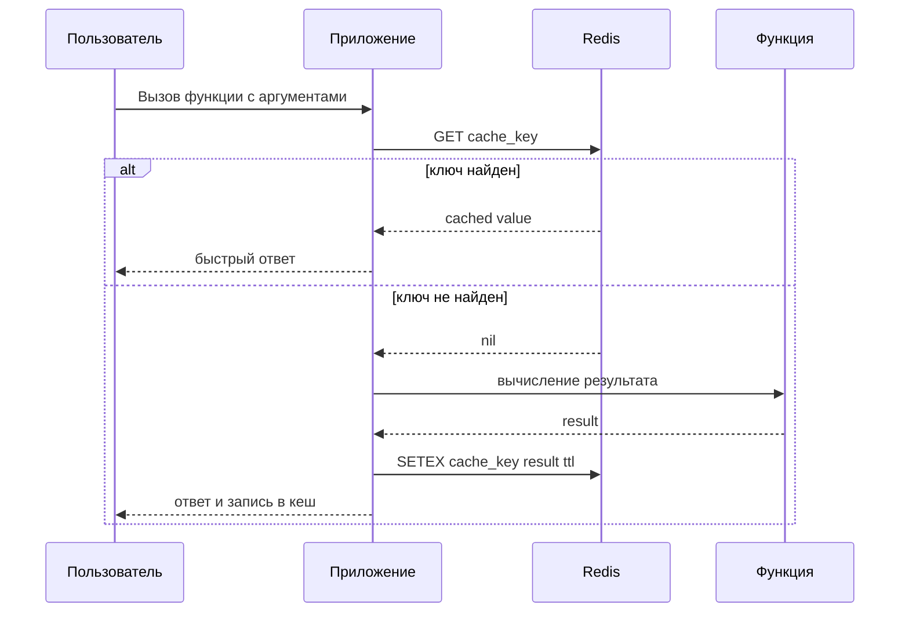

# Практическая работа 3: Redis для кеширования результатов функций

## Цель

Научиться использовать Redis как хранилище `ключ-значение` для кеширования результатов выполнения функций.

## Идея проекта

Небольшое Python-приложение использует Redis двумя способами:

- кеширует результаты "дорогих" функций;
- хранит записи о пользователях в виде ключей Redis и показывает их через web-интерфейс.

## Что реализовано

- `slow_fibonacci(n)` - демонстрация кеширования вычислительной функции.
- `text_statistics(text)` - анализ текста с сохранением результата в Redis.
- Декоратор `redis_cached(...)` - обёртка, которая строит ключ кеша, проверяет Redis и сохраняет результат с TTL.
- Web-приложение `Redis User Admin` - форма добавления пользователей и список записей, лежащих в Redis.
- `InMemoryCache` - простой локальный кеш для автоматических тестов.
- `RedisCache` - подключение к настоящему Redis.

## Схема решения







## Структура проекта

- `main.py` - командная строка для демонстрации
- `src/cache_demo/cache.py` - Redis-кеш и in-memory кеш
- `src/cache_demo/decorators.py` - декоратор кеширования
- `src/cache_demo/services.py` - функции для демонстрации
- `src/practice3_web/` - web-приложение для добавления и просмотра пользователей
- `tests/test_cache.py` - тесты поведения кеша
- `docker-compose.yml` - Redis в контейнере

## Установка Redis

### Через Docker

```bash
docker compose up -d redis
```

После запуска Redis будет доступен на `localhost:6379`.

### Ручной доступ к данным

Подключиться к Redis можно через `redis-cli`:

```bash
redis-cli -h 127.0.0.1 -p 6379
```

Полезные команды для проверки кеша:

```redis
KEYS *
GET cache:slow_fibonacci:...
TTL cache:slow_fibonacci:...
FLUSHDB
```

Если удобнее графический интерфейс, можно использовать Another Redis Desktop Manager и подключиться к `127.0.0.1:6379`.

## Запуск приложения

1. Установить зависимости:

```bash
python3 -m pip install -r requirements.txt
```

2. Убедиться, что Redis запущен.

3. Запустить демонстрацию:

```bash
python3 main.py demo
```

4. Запустить web-приложение:

```bash
python3 main.py web
```

После этого откройте `http://127.0.0.1:5000`.

Пример ожидаемого поведения:

- первый вызов функции выполняется дольше и пишет результат в Redis;
- второй вызов с теми же аргументами возвращает значение из кеша;
- в `redis-cli` видны соответствующие ключи.

Для web-приложения:

- введите имя пользователя и нажмите `Add`;
- запись появится в списке на странице;
- в Redis появятся ключи вида `practice3:user:<id>` и `practice3:users:ids`;
- при обновлении страницы сводка может отрисоваться быстрее за счёт кеша.

## Тестирование

Автотесты проверяют:

- повторный вызов функции идёт из кеша;
- ключ кеша зависит от имени функции и аргументов;
- истечение TTL приводит к повторному вычислению.

Запуск:

```bash
python3 -m unittest discover -s tests -v
```

## Пример демонстрации

```bash
python3 main.py fib 35
python3 main.py fib 35
```

На втором запуске результат должен возвращаться заметно быстрее, если Redis уже содержит ключ.

## Проверка web-приложения

1. Очистить данные:

```bash
docker compose exec -T redis redis-cli FLUSHDB
```

2. Запустить приложение:

```bash
python3 main.py web
```

3. Добавить пользователя через браузер.

4. Проверить данные в Redis:

```bash
docker compose exec -T redis redis-cli KEYS 'practice3:*'
docker compose exec -T redis redis-cli LRANGE practice3:users:ids 0 -1
```
