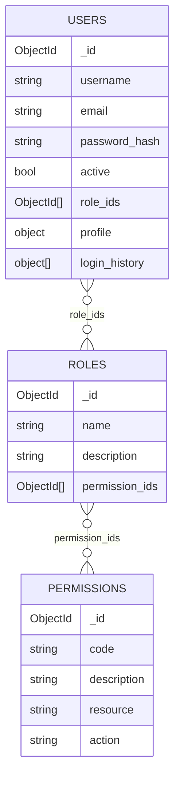

# Практическая работа 4: MongoDB

## Цель

Научиться использовать документо-ориентированную СУБД MongoDB.

## Что реализовано

- 3 коллекции: `users`, `roles`, `permissions`
- вложенные данные в `users`: `profile`, `login_history`
- CRUD для каждой коллекции
- потоковое чтение пользователей через `GET /api/users/stream`
- Swagger UI на `/docs`

## Схема БД



### Пояснение

- `users` хранит пользователя и вложенные данные `profile` и `login_history`.
- `roles` хранит роли и ссылки на права доступа через `permission_ids`.
- `permissions` хранит отдельные права доступа.
- Связи между коллекциями реализованы через `ObjectId`-ссылки.

## Установка MongoDB

```bash
docker compose up -d
```

MongoDB доступна на `mongodb://127.0.0.1:27017`.

## Запуск приложения

```bash
python3 main.py web
```

## Наполнение демо-данными

```bash
python3 main.py seed
```

## Генерация большого объема данных для streaming

```bash
python3 main.py bulk --target-mb 1024
```

Если нужно ускорить генерацию для локальной проверки:

```bash
python3 main.py bulk --target-mb 128
```

Swagger UI:

```bash
http://127.0.0.1:5000/docs
```

## Проверка

### Создать право доступа

```bash
curl -X POST http://127.0.0.1:5000/api/permissions \
  -H "Content-Type: application/json" \
  -d '{
    "code": "users:read",
    "description": "Read users",
    "resource": "users",
    "action": "read"
  }'
```

### Создать роль

```bash
curl -X POST http://127.0.0.1:5000/api/roles \
  -H "Content-Type: application/json" \
  -d '{
    "name": "auditor",
    "description": "Read-only access",
    "permission_ids": ["PUT_PERMISSION_ID_HERE"]
  }'
```

### Создать пользователя

```bash
curl -X POST http://127.0.0.1:5000/api/users \
  -H "Content-Type: application/json" \
  -d '{
    "username": "ivan",
    "email": "ivan@example.com",
    "password_hash": "hash-ivan",
    "role_ids": ["PUT_ROLE_ID_HERE"],
    "profile": {
      "full_name": "Ivan Petrov",
      "department": "Support"
    },
    "login_history": [
      {
        "at": "2026-05-12T12:00:00Z",
        "ip": "127.0.0.1",
        "success": true
      }
    ]
  }'
```

### Потоковое чтение

```bash
curl -N http://127.0.0.1:5000/api/users/stream
```

## Тесты

```bash
python3 -m unittest discover -s tests -v
```
