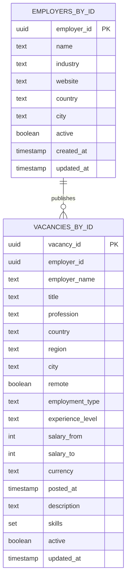
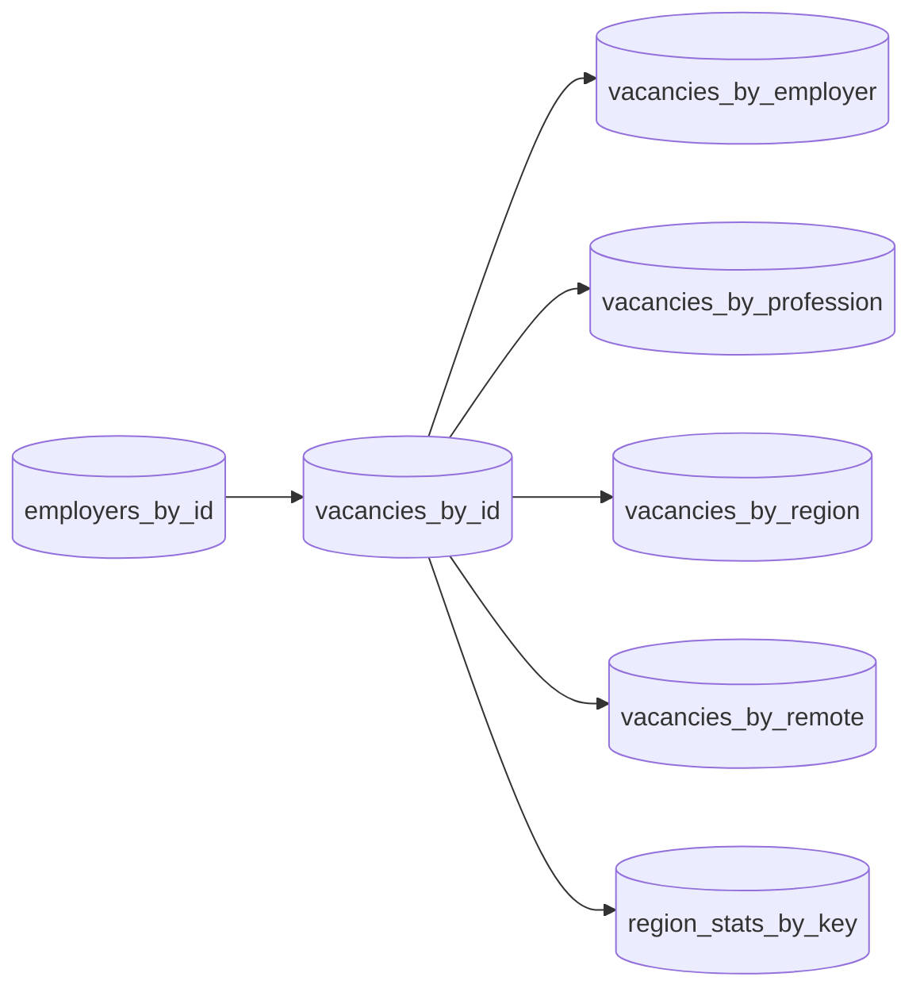

# Практическая работа 5: Apache Cassandra

## Цель

Научиться использовать Apache Cassandra как СУБД семейства столбцов на примере предметной области `статистика вакансий на рынке труда`.

## Что реализовано

- REST API для работы с вакансиями и работодателями.
- Денормализованная Cassandra-схема под разные сценарии чтения.
- Минимум 5 пользовательских запросов на выборку, все через primary key.
- Операции записи, обновления и удаления.
- Режим `memory` для локального запуска и автотестов без Cassandra.
- `schema.cql` для ручного выполнения через `cqlsh`.

## Пользовательские запросы

1. Показать вакансию по `vacancy_id`.
2. Показать вакансии конкретного работодателя.
3. Показать вакансии по профессии.
4. Показать вакансии по региону.
5. Показать удалённые вакансии.
6. Показать статистику вакансий по региону.

Все выборки опираются на первичный ключ соответствующей таблицы, без вторичных индексов и без `ALLOW FILTERING`.

## Модель данных

### ER-диаграмма



### Логическая и физическая схема



### Нотация Чеботко

- `employers_by_id` - основная сущность работодателя по `employer_id`.
- `vacancies_by_id` - основная сущность вакансии по `vacancy_id`.
- `vacancies_by_employer` - запрос всех вакансий работодателя по `(employer_id)`.
- `vacancies_by_profession` - запрос вакансий по `profession`.
- `vacancies_by_region` - запрос вакансий по `(country, region)`.
- `vacancies_by_remote` - запрос удалённых или офисных вакансий по `remote`.
- `region_stats_by_key` - агрегированная статистика по `(country, region)`.

## CQL-схема

Файл со схемой: [`cassandra/schema.cql`](/home/utowa/Non-relational-databases/Practice5/cassandra/schema.cql)

Ключевое пространство:

```sql
CREATE KEYSPACE IF NOT EXISTS job_market
WITH replication = {'class': 'SimpleStrategy', 'replication_factor': 1};
```

## Установка Cassandra

### Через Docker

```bash
docker compose up -d
```

После запуска Cassandra доступна на `127.0.0.1:9042`.

### Ручной доступ

Подключение через `cqlsh`:

```bash
cqlsh 127.0.0.1 9042
```

Полезные команды:

```sql
DESCRIBE KEYSPACES;
USE job_market;
DESCRIBE TABLES;
SELECT * FROM vacancies_by_profession LIMIT 5;
SELECT * FROM vacancies_by_region WHERE country = 'russia' AND region = 'moscow' LIMIT 5;
SELECT * FROM region_stats_by_key WHERE country = 'russia' AND region = 'moscow' LIMIT 1;
```

## Запуск

### Установка зависимостей

```bash
python3 -m pip install -r requirements.txt
```

### REST API на Cassandra

```bash
JOB_MARKET_BACKEND=cassandra python3 main.py web
```

### Локальный режим без Cassandra

```bash
python3 main.py --backend memory demo
```

### Наполнение демо-данными

```bash
python3 main.py --backend memory seed
```

Или для Cassandra:

```bash
JOB_MARKET_BACKEND=cassandra python3 main.py seed
```

## Проверка API

### Создать работодателя

```bash
curl -X POST http://127.0.0.1:5000/api/employers \
  -H "Content-Type: application/json" \
  -d '{
    "name": "Sky Analytics",
    "industry": "Data and BI",
    "website": "https://sky-analytics.example",
    "country": "russia",
    "city": "moscow"
  }'
```

### Создать вакансию

```bash
curl -X POST http://127.0.0.1:5000/api/vacancies \
  -H "Content-Type: application/json" \
  -d '{
    "employer_id": "PUT_EMPLOYER_ID_HERE",
    "employer_name": "Sky Analytics",
    "title": "Senior Python Developer",
    "profession": "python developer",
    "country": "russia",
    "region": "moscow",
    "city": "moscow",
    "remote": true,
    "employment_type": "full-time",
    "experience_level": "senior",
    "salary_from": 300000,
    "salary_to": 400000,
    "currency": "RUB",
    "description": "Build data products and APIs.",
    "skills": ["python", "sql", "cassandra", "flask"]
  }'
```

### Получить вакансии по профессии

```bash
curl "http://127.0.0.1:5000/api/vacancies/by-profession/python%20developer?limit=10"
```

### Получить вакансии по региону

```bash
curl "http://127.0.0.1:5000/api/vacancies/by-region?country=russia&region=moscow&limit=10"
```

### Получить удалённые вакансии

```bash
curl "http://127.0.0.1:5000/api/vacancies/remote?remote=true&limit=10"
```

### Получить статистику региона

```bash
curl "http://127.0.0.1:5000/api/stats/regions?country=russia&region=moscow"
```

## Тестирование

```bash
python3 -m unittest discover -s tests -v
```

Тесты используют `InMemoryJobMarketRepository`, поэтому не требуют поднятого Cassandra-кластера.

## Что показать на защите

1. Поднять Cassandra через Docker.
2. Открыть `cqlsh` и выполнить `SELECT` по таблицам чтения.
3. Запустить приложение.
4. Создать работодателя и вакансии через API.
5. Показать выборки по профессии, региону, работодателю и удалённым вакансиям.
6. Изменить вакансию и удалить вакансию, затем повторно проверить результаты запросов.
