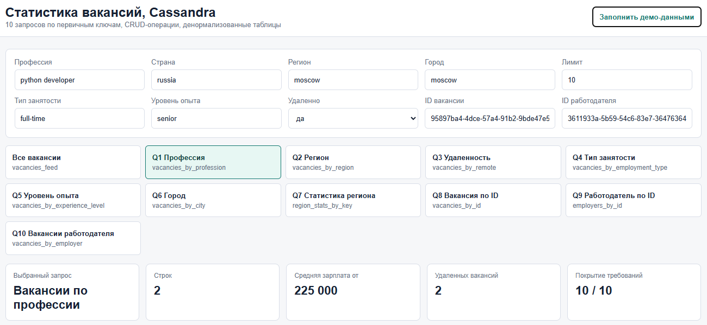
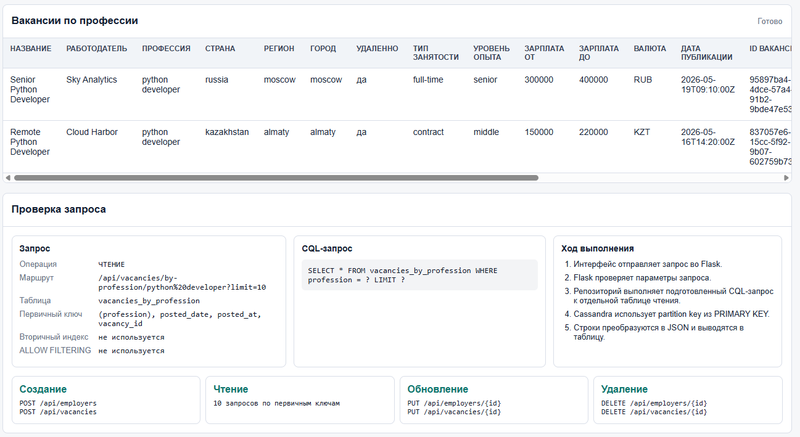
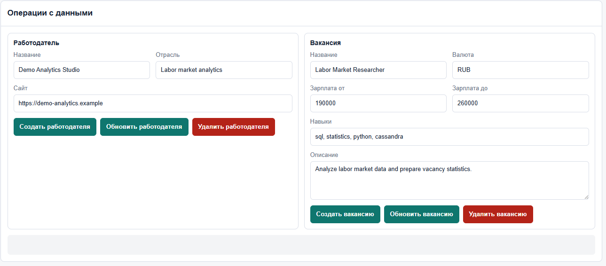
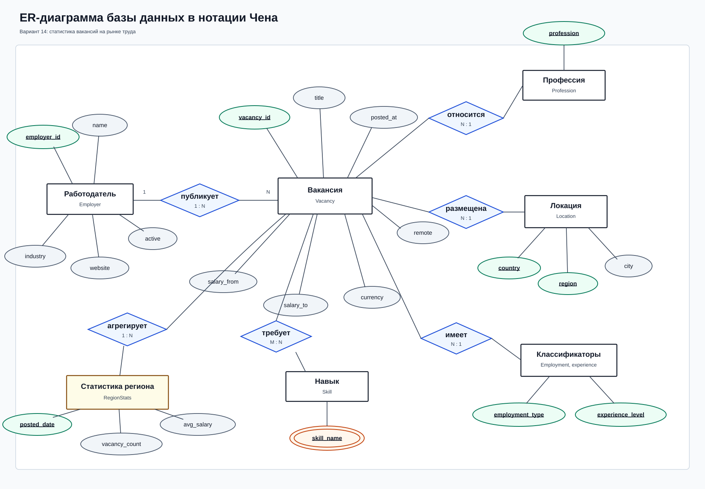
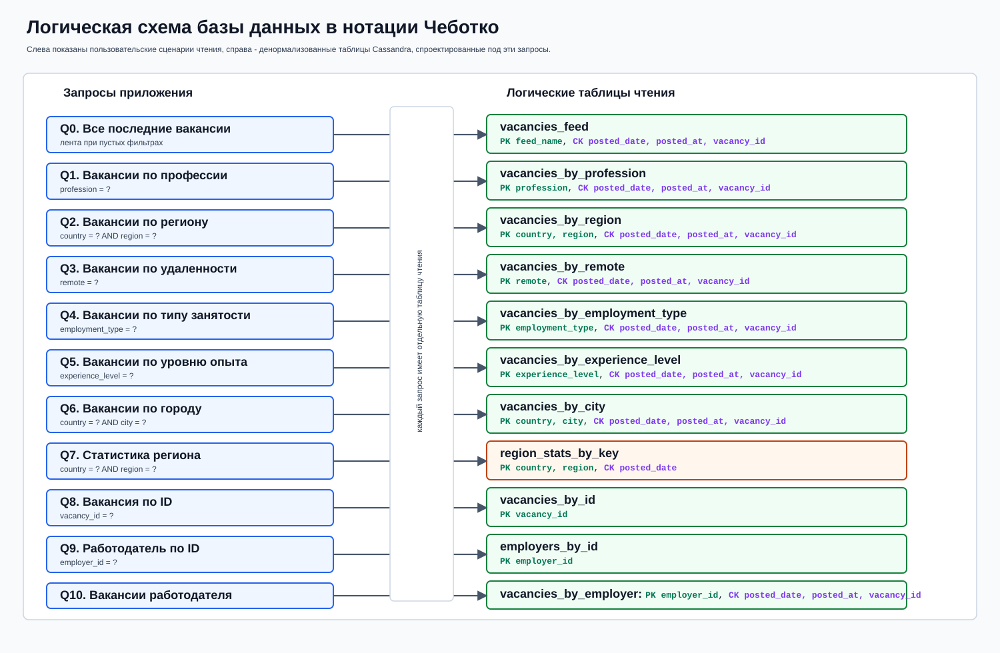
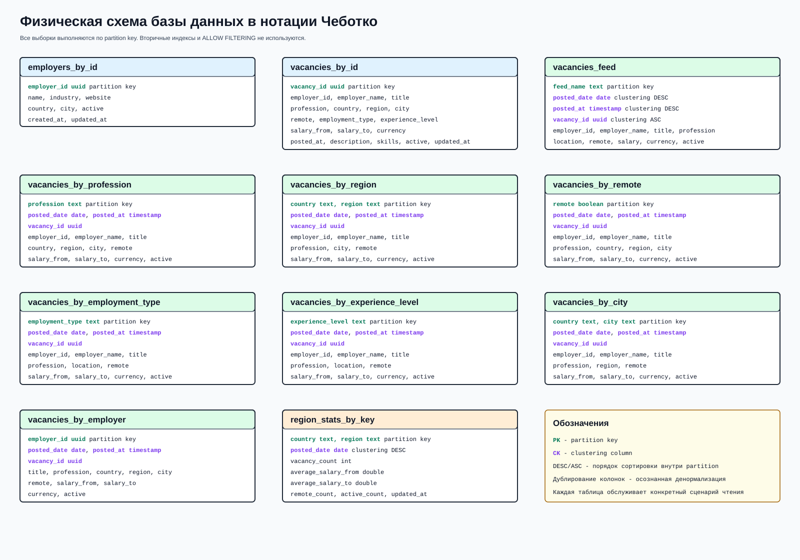

# Практическая работа 5: Apache Cassandra

Вариант 14: **статистика вакансий на рынке труда**.

Проект демонстрирует проектирование приложения под Cassandra в query-first стиле: пользовательские сценарии чтения сначала формулируются как запросы, затем под каждый запрос создается отдельная денормализованная таблица с подходящим первичным ключом. Приложение включает REST API, веб-интерфейс для демонстрации выборок и CRUD-операций, демо-набор данных, тесты и MCP-сервер для read-only доступа к Cassandra.

## Ключевые навыки

- Проектирование Cassandra-схемы под конкретные запросы пользователей.
- Денормализация данных без вторичных индексов и без `ALLOW FILTERING`.
- Реализация REST API на Flask с репозиторным слоем.
- Поддержка синхронной записи в несколько query tables при создании, обновлении и удалении вакансий.
- Контейнеризация Cassandra через Docker Compose.
- Веб-интерфейс для визуальной проверки результатов, CQL-запросов, первичных ключей и CRUD-операций.
- Автотесты без внешней БД через `InMemoryJobMarketRepository`.
- Read-only MCP-сервер для инспекции Cassandra из MCP-клиента.

## Что реализовано

- 8 работодателей и 15 демо-вакансий.
- 10 обязательных пользовательских запросов на выборку.
- Служебная лента всех вакансий для пустых UI-фильтров.
- CRUD для работодателей и вакансий.
- Региональная статистика по вакансиям.
- UI на главной странице приложения.
- CQL-схема в [cassandra/schema.cql](cassandra/schema.cql).
- Тесты в [tests/test_job_market.py](tests/test_job_market.py).

## Демонстрация интерфейса

### Панель фильтров и покрытие требований



### Результаты выборки и проверка Cassandra-запроса



### CRUD-операции



## Проектирование базы данных

Проектирование выполнено в два этапа. Сначала построена концептуальная модель предметной области в нотации Чена, затем Cassandra-схема спроектирована в нотации Чеботко: от пользовательских запросов к логическим таблицам чтения и далее к физическим таблицам с partition key и clustering columns.

### ER-диаграмма в нотации Чена

Диаграмма отражает предметную область до Cassandra-денормализации: работодатель публикует вакансии, вакансия относится к профессии, локации, типу занятости, уровню опыта и набору навыков, а по региону рассчитывается агрегированная статистика.



### Логическая схема в нотации Чеботко

Логическая схема показывает query-first проектирование: каждый пользовательский сценарий чтения сопоставлен с отдельной денормализованной таблицей. Это позволяет выполнять выборки по первичному ключу без вторичных индексов и без построчного чтения.



### Физическая схема в нотации Чеботко

Физическая схема фиксирует реальные Cassandra-таблицы из [cassandra/schema.cql](cassandra/schema.cql), состав partition key, clustering columns, порядок сортировки и набор денормализованных колонок, которые возвращаются API и UI.



## Соответствие обязательным требованиям

| Требование | Статус | Реализация |
| --- | --- | --- |
| Минимум 5 пользовательских запросов на выборку | Выполнено с запасом | Реализовано 10 обязательных запросов + лента всех вакансий |
| Выборки используют первичные индексы | Выполнено | Под каждый запрос создана отдельная Cassandra-таблица с PRIMARY KEY |
| Не используются вторичные индексы и построчное чтение | Выполнено | Нет `CREATE INDEX`, нет `ALLOW FILTERING`; пустые фильтры идут через `vacancies_feed` |
| Есть запись, обновление и удаление данных | Выполнено | `POST`, `PUT`, `DELETE` для работодателей и вакансий |
| Приложение соответствует варианту | Выполнено | Предметная область: статистика вакансий на рынке труда |

## Архитектура

```text
Browser UI
   |
   v
Flask REST API
   |
   v
JobMarketRepository
   |-------------------------------|
   v                               v
CassandraJobMarketRepository       InMemoryJobMarketRepository
   |
   v
Apache Cassandra
```

Основные модули:

- [src/job_market/app.py](src/job_market/app.py) — Flask API и маршруты UI.
- [src/job_market/cassandra_repository.py](src/job_market/cassandra_repository.py) — Cassandra-репозиторий и синхронизация query tables.
- [src/job_market/memory_repository.py](src/job_market/memory_repository.py) — in-memory реализация для тестов.
- [src/job_market/seed.py](src/job_market/seed.py) — детерминированные демо-данные.
- [templates/index.html](templates/index.html) — веб-интерфейс.
- [mcp_cassandra_server.py](mcp_cassandra_server.py) — read-only MCP-сервер.

## Cassandra-модель

В Cassandra таблицы проектируются от запросов. Поэтому данные вакансии дублируются в нескольких таблицах чтения:

| Сценарий | Таблица | Условие по первичному ключу |
| --- | --- | --- |
| Все последние вакансии | `vacancies_feed` | `feed_name = 'all'` |
| Вакансия по ID | `vacancies_by_id` | `vacancy_id = ?` |
| Работодатель по ID | `employers_by_id` | `employer_id = ?` |
| Вакансии работодателя | `vacancies_by_employer` | `employer_id = ?` |
| Вакансии по профессии | `vacancies_by_profession` | `profession = ?` |
| Вакансии по региону | `vacancies_by_region` | `country = ? AND region = ?` |
| Вакансии по удаленности | `vacancies_by_remote` | `remote = ?` |
| Вакансии по типу занятости | `vacancies_by_employment_type` | `employment_type = ?` |
| Вакансии по уровню опыта | `vacancies_by_experience_level` | `experience_level = ?` |
| Вакансии по городу | `vacancies_by_city` | `country = ? AND city = ?` |
| Статистика региона | `region_stats_by_key` | `country = ? AND region = ?` |

Пример CQL-запроса:

```sql
SELECT *
FROM vacancies_by_profession
WHERE profession = ?
LIMIT ?;
```

Вторичные индексы и `ALLOW FILTERING` не применяются.

## CRUD-логика

При создании или обновлении вакансии приложение:

1. Записывает основную запись в `vacancies_by_id`.
2. Обновляет денормализованные таблицы чтения:
   `vacancies_feed`, `vacancies_by_profession`, `vacancies_by_region`, `vacancies_by_remote`, `vacancies_by_employment_type`, `vacancies_by_experience_level`, `vacancies_by_city`, `vacancies_by_employer`.
3. Пересчитывает статистику региона в `region_stats_by_key`.

При удалении вакансии запись удаляется из основной и денормализованных таблиц, после чего статистика региона пересчитывается.

## Запуск

### 1. Установить зависимости

```bash
python -m pip install -r requirements.txt
```

### 2. Запустить Cassandra

```bash
docker compose up -d
```

Cassandra доступна на `127.0.0.1:9042`.

Проверка через `cqlsh`:

```bash
docker exec -it practice5-cassandra cqlsh
```

### 3. Заполнить Cassandra демо-данными

```bash
python main.py --backend cassandra seed
```

Ожидаемый результат:

```text
Seeded objects:
- employers: 8
- vacancies: 15
- region_stats: 8
```

### 4. Запустить веб-приложение

```bash
python main.py --backend cassandra web
```

Открыть:

```text
http://127.0.0.1:5000/
```

## Быстрый запуск без Cassandra

Для проверки бизнес-логики и UI можно использовать in-memory режим:

```bash
python main.py --backend memory demo
python main.py --backend memory web
```

## API

### Демо-данные

```bash
curl -X POST http://127.0.0.1:5000/api/admin/seed
```

### Выборки

```bash
curl "http://127.0.0.1:5000/api/vacancies?limit=10"
curl "http://127.0.0.1:5000/api/vacancies/by-profession/python%20developer?limit=10"
curl "http://127.0.0.1:5000/api/vacancies/by-region?country=russia&region=moscow&limit=10"
curl "http://127.0.0.1:5000/api/vacancies/remote?remote=true&limit=10"
curl "http://127.0.0.1:5000/api/vacancies/by-employment-type/full-time?limit=10"
curl "http://127.0.0.1:5000/api/vacancies/by-experience-level/senior?limit=10"
curl "http://127.0.0.1:5000/api/vacancies/by-city?country=russia&city=moscow&limit=10"
curl "http://127.0.0.1:5000/api/stats/regions?country=russia&region=moscow"
```

### Создание работодателя

```bash
curl -X POST http://127.0.0.1:5000/api/employers \
  -H "Content-Type: application/json" \
  -d '{
    "name": "Demo Analytics Studio",
    "industry": "Labor market analytics",
    "website": "https://demo-analytics.example",
    "country": "russia",
    "city": "moscow"
  }'
```

### Создание вакансии

```bash
curl -X POST http://127.0.0.1:5000/api/vacancies \
  -H "Content-Type: application/json" \
  -d '{
    "employer_id": "PUT_EMPLOYER_ID_HERE",
    "employer_name": "Demo Analytics Studio",
    "title": "Labor Market Researcher",
    "profession": "labor market analyst",
    "country": "russia",
    "region": "moscow",
    "city": "moscow",
    "remote": true,
    "employment_type": "full-time",
    "experience_level": "middle",
    "salary_from": 190000,
    "salary_to": 260000,
    "currency": "RUB",
    "description": "Analyze labor market data and prepare vacancy statistics.",
    "skills": ["sql", "statistics", "python", "cassandra"]
  }'
```

Обновление и удаление выполняются через:

```bash
PUT /api/employers/{employer_id}
DELETE /api/employers/{employer_id}
PUT /api/vacancies/{vacancy_id}
DELETE /api/vacancies/{vacancy_id}
```

## Тестирование

```bash
python -m unittest discover -s tests -v
```

Тесты проверяют:

- 10 сценариев чтения;
- JSON-ответы API;
- создание, обновление и удаление работодателей;
- создание, обновление и удаление вакансий;
- региональную статистику;
- поведение `/api/vacancies` и `/api/vacancies/`;
- наличие ключевых элементов UI.

## MCP-сервер

Для дополнительного read-only доступа к Cassandra реализован MCP-сервер:

```bash
python -m pip install -r requirements-mcp.txt
python mcp_cassandra_server.py --smoke-test
```

Инструменты MCP:

- `cassandra_health`
- `list_tables`
- `describe_table`
- `recent_vacancies`
- `vacancies_by_profession`
- `vacancies_by_region`
- `vacancies_by_remote`
- `vacancies_by_employment_type`
- `vacancies_by_experience_level`
- `vacancies_by_city`
- `region_stats`
- `safe_select`

Ресурс схемы:

```text
cassandra://practice5/schema
```

## Структура проекта

```text
Practice5/
  assets/
    chebotko-logical.svg
    chebotko-physical.svg
    er-chen.svg
    part1.png
    part2.png
    part3.png
  cassandra/
    schema.cql
  src/job_market/
    app.py
    cassandra_repository.py
    memory_repository.py
    models.py
    repository.py
    seed.py
    services.py
  templates/
    index.html
  tests/
    test_job_market.py
  docker-compose.yml
  main.py
  mcp_cassandra_server.py
  requirements.txt
  requirements-mcp.txt
```

## Итог

Практическая работа выполнена в полном объеме: приложение использует Apache Cassandra как основную БД, реализует предметную область варианта 14, содержит 10 пользовательских запросов на выборку по первичным ключам, поддерживает запись, обновление и удаление данных, имеет веб-интерфейс для демонстрации работы и покрыто автотестами.
